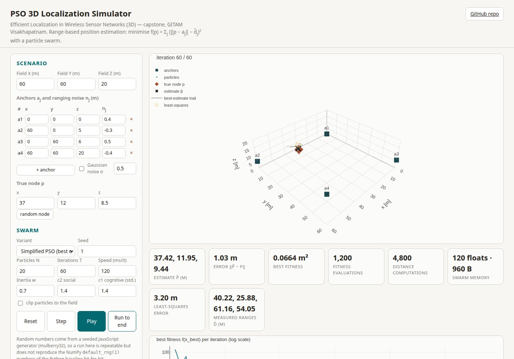
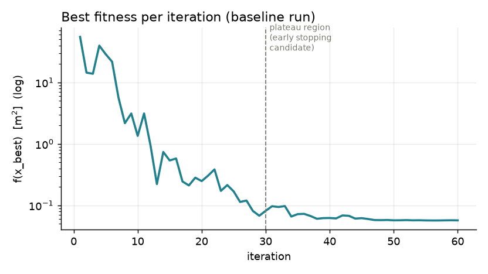
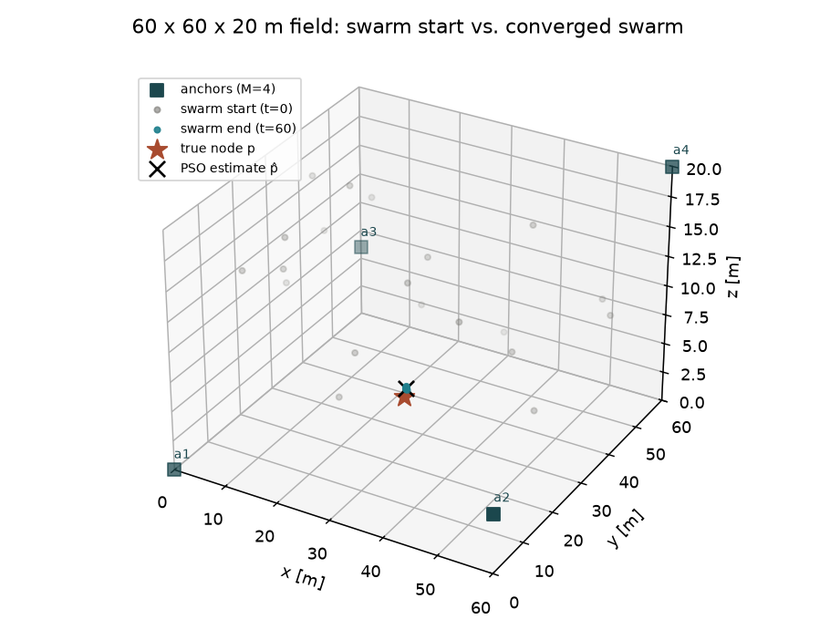
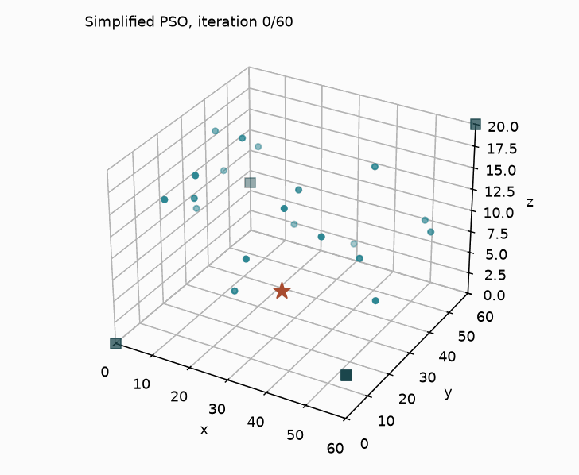
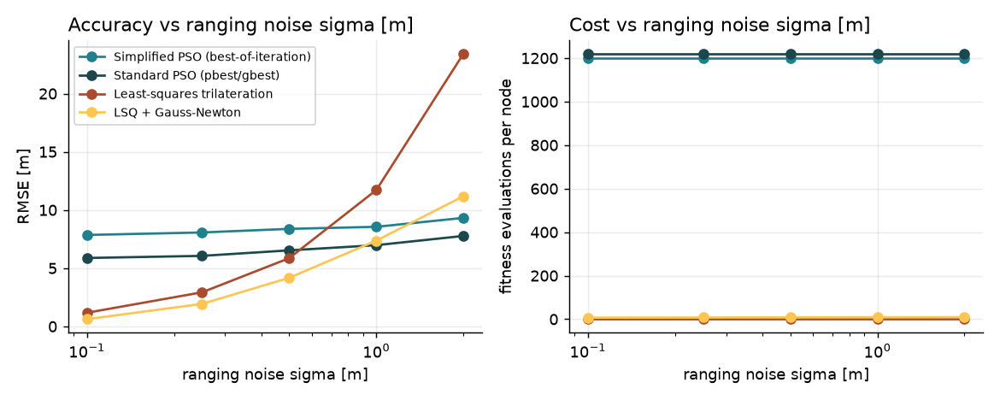
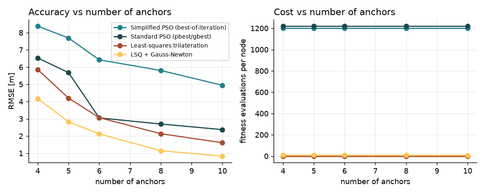
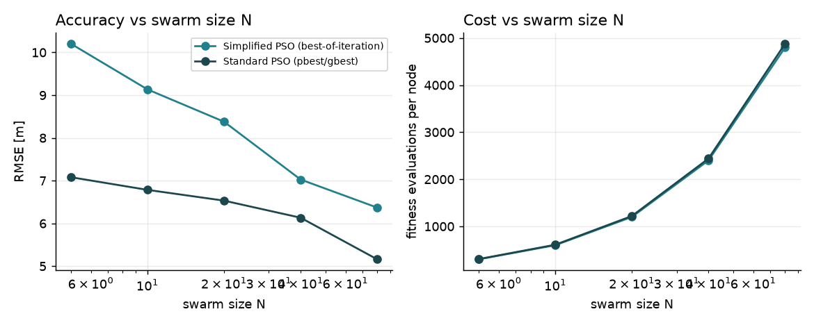
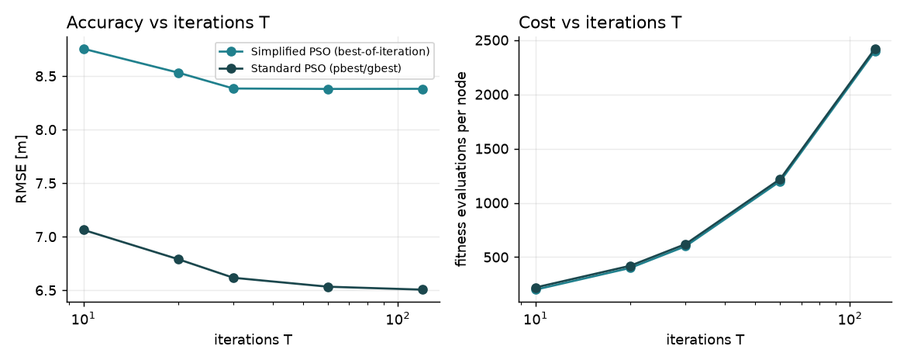
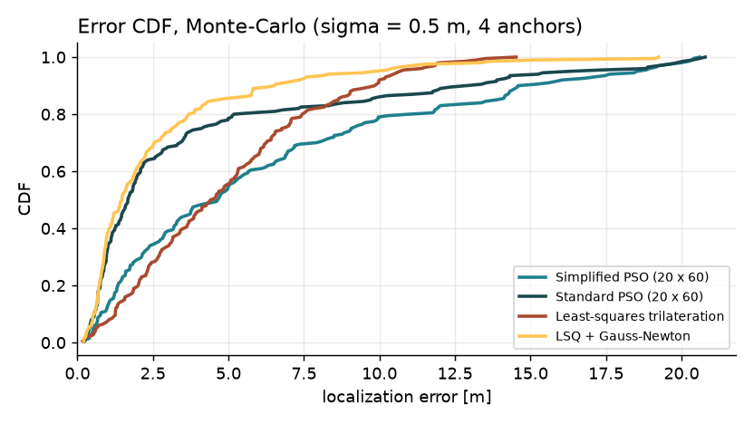

# Efficient Localization in Wireless Sensor Networks (3D) — PSO-based node localization

**Capstone project PROJ2999 · B.Tech CSE (Core) · GITAM School of CSE, Visakhapatnam · Phase 1 (Sep–Nov 2026)**

**Live 3D simulator:** https://capstone-pso3d.vercel.app · **Code:** Python 3 / NumPy package [`pso3d/`](pso3d/) · **Web app:** [`web/`](web/) (plain HTML/JS + Plotly)



## Summary

Sensor nodes only produce useful data if their positions are known, but GPS on every node is too costly and
fails indoors, underwater and under canopy. A few *anchor* nodes know their position; every other node measures
noisy distances to the anchors (RSSI / ToA) and must work out its own 3D position. Because the distances are
noisy the range spheres do not meet at one point, so localization becomes an optimization problem:

$$\hat p = \arg\min_{p \in \Omega} f(p), \qquad f(p) = \sum_{j=1}^{M} \big(\lVert p - a_j \rVert - \hat d_j\big)^2$$

This repository contains a working **Particle Swarm Optimization (PSO) 3D localizer**, its baseline experiment from
Review 1, closed-form comparison methods (least-squares trilateration, Gauss-Newton), a Monte-Carlo parameter study,
plots, an interactive browser simulation, and the start of the base-paper algorithm **AMCMPSO** (Alhasan et al., 2023).

## Problem statement

Existing PSO-based localization schemes for WSNs are mostly designed for two-dimensional fields. When extended to 3D,
the extra dimension enlarges the search space, needs at least four non-coplanar anchors and many more fitness
evaluations, and results in high computational and space complexity on sensor nodes that have limited energy,
computing power and memory. At the same time, ranging noise and weak anchor geometry reduce accuracy. A PSO-based
3D localization model is therefore needed that improves localization accuracy in WSNs **without compromising
network resources**.

## Objectives (Phase 1)

| # | Objective | Gap addressed | Where in this repo |
|---|-----------|---------------|--------------------|
| 1 | **Formulate** 3D localization as range-error minimisation over Ω with ≥ 4 non-coplanar anchors | weak 3D-native design | [`pso3d/fitness.py`](pso3d/fitness.py), [`pso3d/config.py`](pso3d/config.py) |
| 2 | **Implement** a PSO 3D localizer in Python/NumPy (baseline) and reproduce the base paper's AMCMPSO | 3D design, accuracy-for-effort | [`pso3d/pso.py`](pso3d/pso.py), [`pso3d/standard_pso.py`](pso3d/standard_pso.py), [`pso3d/amcmpso.py`](pso3d/amcmpso.py) *(in progress)* |
| 3 | **Measure** accuracy (error, RMSE) vs. noise, anchors, swarm size, iterations; target sub-metre error in 60 × 60 × 20 m | accuracy-for-effort | [`scripts/run_experiments.py`](scripts/run_experiments.py), [`results/results.md`](results/results.md) |
| 4 | **Quantify** computational and space complexity (fitness evaluations, run time, swarm memory per node) as the Phase-2 baseline | computational cost, memory | evaluation counters in `RangeErrorFitness`, `PSOResult` |

## Architecture

```
 anchor discovery ──▶ ranging (RSSI/ToA) ──▶ position estimation ──▶ output & evaluation
 (assumed done)        d̂_j = ‖p−a_j‖ + n_j     PSO minimises f(p)      p̂, error, RMSE, #evals,
                                               over Ω=[0,60]²×[0,20]   run time, memory
```

```
pso3d/
  config.py        Scenario (field, anchors, true node, noise) — defaults = slide 16 of the Review-1 deck
  fitness.py       RangeErrorFitness: f(p) with fitness-evaluation and distance-computation counters
  pso.py           SimplifiedPSO: v ← 0.7·v + 1.4·r⊙(x_best − x), best-of-iteration only (the Review-1 code)
  standard_pso.py  StandardPSO: pbest/gbest memory (reference PSO)
  amcmpso.py       AMCMPSO scaffold — IN PROGRESS (see Roadmap)
  trilateration.py least-squares trilateration + Gauss-Newton refinement (closed-form comparison)
  experiments.py   Monte-Carlo / parameter sweeps (noise, anchors, swarm size, iterations)
  plots.py         Matplotlib figures and the convergence GIF
scripts/           run_baseline.py, run_experiments.py
results/           baseline.json, sweeps.csv, results.md      figures/   PNG + GIF (generated)
web/               interactive simulator (index.html, pso.js, app.js) — deployed on Vercel
tests/             pytest (baseline reproduction, noise-free sanity, clipping)
```

## How to run

```bash
git clone https://github.com/D-L-Narayana/CAPSTONE.git && cd CAPSTONE
python -m venv .venv && source .venv/bin/activate      # optional
pip install -r requirements.txt

python scripts/run_baseline.py          # reproduces the Review-1 result, writes results/baseline.json + figures
python scripts/run_experiments.py       # Monte-Carlo study (200 nodes/setting, ~20 s), writes results/results.md
python -m pytest -q tests               # 3 tests

# web simulator (no build step)
python -m http.server 8000 --directory web   # then open http://localhost:8000
```

## Baseline experiment (Review 1, slide 16) — reproduced

| Parameter | Value |
|---|---|
| Field Ω | 60 × 60 × 20 m |
| Anchors (M = 4) | (0, 0, 0), (60, 0, 5), (0, 60, 6), (60, 60, 20) |
| True node p | (37.0, 12.0, 8.5) m |
| Ranging noise n_j | (+0.4, −0.3, +0.5, −0.4) m → d̂ = (40.215, 25.877, 61.157, 54.054) m |
| Swarm / iterations | 20 particles / 60 iterations, w = 0.7, c = 1.4, seed 1 (`numpy.random.default_rng(1)`) |
| PSO variant | simplified: one social term towards the best particle of the *current* iteration, no pbest/gbest, no clipping |

Output of `python scripts/run_baseline.py` (this run):

| Method | Estimate p̂ (m) | Error (m) | Fitness evals | Distance comps | Swarm memory (floats) |
|---|---|---|---|---|---|
| **Simplified PSO (Review-1 code)** | **(37.43, 11.90, 9.29)** | **0.90** (Δx +0.43, Δy −0.10, Δz +0.79) | 1 200 | 4 800 | 120 (= 20 × 3 × 2) |
| Least-squares trilateration | (37.13, 11.44, 11.65) | 3.20 | 0 (one (M−1)×3 solve) | – | 15 |
| Least squares + Gauss-Newton | (37.42, 11.88, 9.36) | 0.96 | 10 GN steps | – | 15 |
| Standard PSO (pbest/gbest), same budget | (37.42, 11.89, 9.35) | 0.96 | 1 220 | 4 880 | 183 |
| AMCMPSO scaffold *(in progress)* | (37.42, 11.88, 9.36) | 0.96 | 1 220 | 4 880 | 186 |

* The estimate **(37.43, 11.90, 9.29) m with error 0.90 m is reproduced exactly** (`tests/test_pso.py`).
  Run time ≈ 1.7 ms on a laptop-class CPU.
* Most of the error is vertical (Δz = 0.79 m) because anchor heights span only 0–20 m against 60 m in x and y.
* Honest note on convergence: the best fitness is within 2× of its final value from iteration 26 and within 10 % from
  iteration 38, i.e. the swarm has essentially stopped improving after ≈ 30 iterations, so early stopping could save
  roughly half of the 1 200 evaluations (the simple patience-based stopper in `SimplifiedPSO` did **not** trigger on
  this run because the per-iteration best keeps improving by tiny amounts — a tolerance-based criterion is needed).
* Least squares + Gauss-Newton, standard PSO and the AMCMPSO scaffold all converge to the **true minimiser of f**,
  (37.42, 11.88, 9.36) m, whose error is 0.96 m. The simplified PSO's 0.90 m is slightly *better* only because it had
  not fully converged; with this noise the accuracy floor is set by the ranging errors, not by the optimiser.

| Convergence (baseline) | Swarm start vs. end |
|---|---|
|  |  |



## Monte-Carlo parameter study

200 random nodes per setting, uniform in the field, Gaussian ranging noise; the first four anchors are the fixed
non-coplanar corners above, extra anchors are random. Full tables: [`results/results.md`](results/results.md),
raw data: [`results/sweeps.csv`](results/sweeps.csv).

| σ = 0.5 m, 4 anchors, N = 20, T = 60 | RMSE (m) | median (m) | p90 (m) | fitness evals | memory (floats) |
|---|---|---|---|---|---|
| Simplified PSO (best-of-iteration) | 8.38 | 4.66 | 14.65 | 1 200 | 120 |
| Standard PSO (pbest/gbest) | 6.53 | 1.67 | 12.93 | 1 220 | 183 |
| Least-squares trilateration | 5.86 | 4.48 | 9.85 | 0 | 15 |
| Least squares + Gauss-Newton | 4.17 | 1.48 | 6.53 | ≈ 8 | 15 |

| Noise | Anchors |
|---|---|
|  |  |
| **Swarm size** | **Iterations** |
|  |  |



What the study shows (and what it does not):

* The single-node 0.90 m result **does not generalise** to arbitrary node positions with only four corner anchors:
  errors have a heavy tail (p90 > 10 m) for every method. This is a geometry problem — nodes far from the anchors
  and the small height spread (0–20 m) produce weak vertical geometry and flip ambiguity along z — exactly Gap 1 of
  the Review-1 deck.
* The simplified PSO (no personal/global-best memory) converges prematurely: even at σ = 0.1 m its RMSE is ≈ 7.9 m,
  while standard PSO and Gauss-Newton reach ≈ 1 m. Memory-free swarms are cheap (120 floats) but pay in accuracy —
  the accuracy-vs-cost trade-off Phase 2 is about.
* More anchors help every method (RMSE roughly halves from 4 → 10 anchors); more particles help slowly and cost
  linearly; more than ≈ 30 iterations bring nothing for the simplified PSO (plateau).
* Least squares + Gauss-Newton is the strongest and cheapest single-node estimator here (≈ 8 residual evaluations,
  15 floats) and is therefore the natural **warm start** for PSO in Phase 2.

## Interactive web simulation

[`web/`](web/) is a static page (Plotly.js, no build step) deployed on Vercel: **https://capstone-pso3d.vercel.app**

* Edit field size, anchors (add/remove, ≥ 4), per-anchor noise or Gaussian σ, true node, swarm size, iterations,
  w, c1/c2, seed, clipping, and the PSO variant (simplified vs standard).
* Step / play / run-to-end; watch the particles converge in 3D with the best-estimate trail; live KPIs for estimate,
  error, best fitness, fitness evaluations, distance computations, swarm memory and the least-squares comparison;
  log-scale convergence chart.
* The JS port uses a seeded mulberry32 generator, so runs are repeatable but do not reproduce the NumPy
  `default_rng(1)` numbers bit-for-bit.

## Roadmap

- [x] Formulation, baseline simplified PSO, evaluation and memory counters (Objectives 1, 4)
- [x] Least-squares / Gauss-Newton comparison, Monte-Carlo parameter study, plots (Objective 3)
- [x] Interactive 3D web simulation on Vercel
- [ ] **AMCMPSO** ([`pso3d/amcmpso.py`](pso3d/amcmpso.py)) — *in progress*: the class runs (adaptive w/c1/c2, swarm-mean
      and centre-of-mass guidance) but the exact update equations and constants still have to be transcribed from
      Section 3 of Alhasan et al. (2023) and validated against the paper's reported numbers (improvement rate 99.86 %,
      error < 1.34 cm, 3D coverage > 87 %). Its current output must not be quoted as a reproduction of the paper.
- [ ] Multi-node auto-localization (localized nodes become anchors), coverage metric, NLOS noise model
- [ ] Phase 2: early stopping with tolerance, least-squares warm start, compact / reduced-state swarms, energy model

## Team and guide

| Role | Name | Roll no. |
|---|---|---|
| Team leader | D L Narayana | 2023006368 |
| Member | Kommareddy Chiranjeevi Ashutosh | 2023002406 |
| Member | S N S Vijay Vagdeesh | 2023005066 |
| Member | Pukkalla Yaswanth | 2023004181 |

**Guide:** Dr. Pujasuman Tripathy, Assistant Professor, Department of Computer Science and Systems Engineering,
GITAM School of Computer Science and Engineering, Visakhapatnam.

## Repository documents (Review 1)

* `3D Localization in WSN — 10 Codes with Summaries.pdf` — the ten original scripts (RSSI ranging, trilateration,
  least squares, DV-Hop, weighted centroid, APIT, Gauss-Newton MLE, MDS-MAP, PSO, Kalman) with explanations
* `PSO-Based 3D Localization in WSN — Paper Review.docx` — literature review (10 papers + base paper)
* `Base Paper — Bio-inspired Node Localization in WSN (Kulkarni et al., 2009).pdf` — background paper [4]

## References

1. R. V. Kulkarni and G. K. Venayagamoorthy, "Particle swarm optimization in wireless-sensor networks: A brief survey," *IEEE Trans. Systems, Man, and Cybernetics, Part C*, 41(2), 262–267, 2011. https://doi.org/10.1109/TSMCC.2010.2054080
2. R. Ahmad, W. Alhasan, R. Wazirali, N. Aleisa, "Optimization algorithms for wireless sensor networks node localization: An overview," *IEEE Access*, 12, 50459–50488, 2024. https://doi.org/10.1109/ACCESS.2024.3385487
3. J. Kumari, P. Kumar, S. K. Singh, "Localization in three-dimensional wireless sensor networks: a survey," *The Journal of Supercomputing*, 75(8), 5040–5083, 2019. https://doi.org/10.1007/s11227-019-02781-1
4. R. V. Kulkarni, G. K. Venayagamoorthy, M. X. Cheng, "Bio-inspired node localization in wireless sensor networks," *Proc. IEEE SMC*, 205–210, 2009. https://doi.org/10.1109/ICSMC.2009.5346107
5. J. Kennedy and R. Eberhart, "Particle swarm optimization," *Proc. IEEE ICNN*, 1942–1948, 1995. https://doi.org/10.1109/ICNN.1995.488968
6. V. Kanwar and A. Kumar, "Range free localization for three dimensional wireless sensor networks using multi objective particle swarm optimization," *Wireless Personal Communications*, 117(2), 901–921, 2021. https://doi.org/10.1007/s11277-020-07902-1
7. H. Wu, J. Liu, Z. Dong, Y. Liu, "A hybrid mobile node localization algorithm based on adaptive MCB-PSO approach in wireless sensor networks," *Wireless Communications and Mobile Computing*, 2020, art. 3845407. https://doi.org/10.1155/2020/3845407
8. Y. Lv, W. Liu, Z. Wang, Z. Zhang, "WSN localization technology based on hybrid GA-PSO-BP algorithm for indoor three-dimensional space," *Wireless Personal Communications*, 114(1), 167–184, 2020. https://doi.org/10.1007/s11277-020-07357-4
9. X. Huang, D. Han, M. Cui, G. Lin, X. Yin, "Three-dimensional localization algorithm based on improved A* and DV-Hop algorithms in wireless sensor network," *Sensors*, 21(2), 448, 2021. https://doi.org/10.3390/s21020448
10. P. Singh and N. Mittal, "An efficient localization approach to locate sensor nodes in 3D wireless sensor networks using adaptive flower pollination algorithm," *Wireless Networks*, 27(3), 1999–2014, 2021. https://doi.org/10.1007/s11276-021-02557-7
11. G. S. Walia et al., "Three dimensional optimum node localization in dynamic wireless sensor networks," *Computers, Materials & Continua*, 70(1), 305–321, 2022. https://doi.org/10.32604/cmc.2022.019171
12. H. Y. Abuaddous et al., "Repulsion-based grey wolf optimizer with improved exploration and exploitation capabilities to localize sensor nodes in 3D wireless sensor network," *Soft Computing*, 27(7), 3869–3885, 2023. https://doi.org/10.1007/s00500-022-07590-y
13. M. R. Reddy and M. L. Ravi Chandra, "An enhanced 3D-DV-hop localisation algorithm for 3D wireless sensor networks," *Wireless Networks*, 30(6), 5809–5821, 2024. https://doi.org/10.1007/s11276-023-03356-y
14. S. Koulaeizadeh et al., "A hybrid positioning framework for large-scale three-dimensional IoT environments," *Sensors*, 25(22), 6943, 2025. https://doi.org/10.3390/s25226943
15. H. Singh et al., "Hybrid optimized 3D localization for WSN-assisted IoT networks in smart agriculture," *Int. J. of Mathematical, Engineering and Management Sciences*, 10(6), 1967–1988, 2025. https://doi.org/10.33889/IJMEMS.2025.10.6.091
16. **Base paper:** W. Alhasan, R. Ahmad, R. Wazirali, N. Aleisa, W. Abo Shdeed, "Adaptive mean center of mass particle swarm optimizer for auto-localization in 3D wireless sensor networks," *Journal of King Saud University – Computer and Information Sciences*, 35(9), 101782, 2023. https://doi.org/10.1016/j.jksuci.2023.101782

## License

MIT — see [LICENSE](LICENSE).
