# Efficient Localization in Wireless Sensor Networks (3D) — PSO-based node localization

**Capstone project PROJ2999 · B.Tech CSE (Core) · GITAM School of CSE, Visakhapatnam · Phase 1 (Sep–Nov 2026)**

**Live 3D simulator:** https://capstone-pso3d.vercel.app · **Code:** Python 3 / NumPy package [`pso3d/`](pso3d/) · **Web app:** [`web/`](web/) (plain HTML/JS + Plotly)

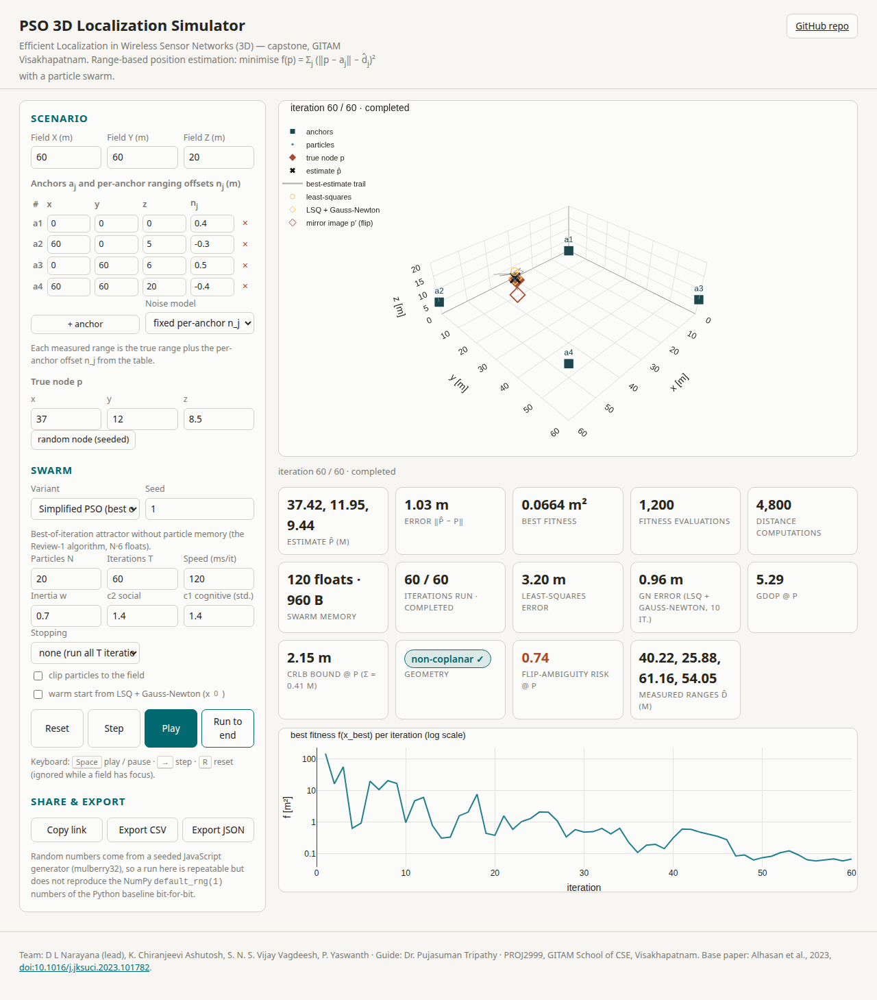

## Summary

Sensor nodes only produce useful data if their positions are known, but GPS on every node is too costly and
fails indoors, underwater and under canopy. A few *anchor* nodes know their position; every other node measures
noisy distances to the anchors (RSSI / ToA) and must work out its own 3D position. Because the distances are
noisy the range spheres do not meet at one point, so localization becomes an optimization problem:

$$\hat p = \arg\min_{p \in \Omega} f(p), \qquad f(p) = \sum_{j=1}^{M} \big(\lVert p - a_j \rVert - \hat d_j\big)^2$$

This repository contains a working **Particle Swarm Optimization (PSO) 3D localizer**, its baseline experiment from
Review 1, closed-form comparison methods (least-squares trilateration, Gauss-Newton), a Monte-Carlo parameter study,
plots, an interactive browser simulation, and a configurable *interpretation* of the base-paper algorithm **AMCMPSO**
(Alhasan et al., 2023; status in the Roadmap).

Phase 2 adds, on top of the unchanged Phase-1 baseline: stopping rules and a least-squares warm start for every PSO
variant, ranging-noise models (Gaussian, uniform-percent, log-normal shadowing, NLOS) and a robust Huber fitness,
geometry diagnostics (non-coplanarity, GDOP, Cramér–Rao bound, flip-ambiguity risk), a multi-node iterative
auto-localization simulator with coverage metrics, an extended Monte-Carlo registry with a CRLB reference column,
a `python -m pso3d` command line, and a browser simulator that exposes the same algorithms with shareable links and
CSV/JSON export. Every number below comes from a command in this repository; see [CHANGELOG.md](CHANGELOG.md) and
[CONTRIBUTING.md](CONTRIBUTING.md).

## Problem statement

Existing PSO-based localization schemes for WSNs are mostly designed for two-dimensional fields. When extended to 3D,
the extra dimension enlarges the search space, needs at least four non-coplanar anchors and many more fitness
evaluations, and results in high computational and space complexity on sensor nodes that have limited energy,
computing power and memory. At the same time, ranging noise and weak anchor geometry reduce accuracy. A PSO-based
3D localization model is therefore needed that improves localization accuracy in WSNs **without compromising
network resources**.

## Objectives (Phase 1)

| # | Objective | Gap addressed | Where in this repo |
|---|-----------|---------------|--------------------|
| 1 | **Formulate** 3D localization as range-error minimisation over Ω with ≥ 4 non-coplanar anchors | weak 3D-native design | [`pso3d/fitness.py`](pso3d/fitness.py), [`pso3d/config.py`](pso3d/config.py) |
| 2 | **Implement** a PSO 3D localizer in Python/NumPy (baseline) and reproduce the base paper's AMCMPSO | 3D design, accuracy-for-effort | [`pso3d/pso.py`](pso3d/pso.py), [`pso3d/standard_pso.py`](pso3d/standard_pso.py), [`pso3d/amcmpso.py`](pso3d/amcmpso.py) *(interpretation — see [`docs/amcmpso.md`](docs/amcmpso.md))* |
| 3 | **Measure** accuracy (error, RMSE) vs. noise, anchors, swarm size, iterations; target sub-metre error in 60 × 60 × 20 m | accuracy-for-effort | [`scripts/run_experiments.py`](scripts/run_experiments.py), [`results/results.md`](results/results.md) |
| 4 | **Quantify** computational and space complexity (fitness evaluations, run time, swarm memory per node) as the Phase-2 baseline | computational cost, memory | evaluation counters in `RangeErrorFitness`, `PSOResult` |

## Architecture

```
 anchor discovery ──▶ ranging (RSSI/ToA) ──▶ position estimation ──▶ output & evaluation
 (assumed done)        d̂_j = ‖p−a_j‖ + n_j     PSO minimises f(p)      p̂, error, RMSE, #evals,
                                               over Ω=[0,60]²×[0,20]   run time, memory
```

```
pso3d/
  config.py        Scenario (field, anchors, true node, noise) — defaults = slide 16 of the Review-1 deck
  fitness.py       RangeErrorFitness: f(p) with fitness-evaluation and distance-computation counters
  robust.py        HuberRangeFitness, WeightedRangeFitness (outlier-tolerant / weighted variants)
  pso.py           SimplifiedPSO: v ← 0.7·v + 1.4·r⊙(x_best − x), best-of-iteration only (the Review-1 code)
  standard_pso.py  StandardPSO: pbest/gbest memory (reference PSO)
  amcmpso.py       AMCMPSO — configurable interpretation of the base-paper idea (docs/amcmpso.md; see Roadmap)
  stopping.py      Patience, Tolerance, MaxEvaluations, TargetFitness, AnyOf stopping rules
  trilateration.py least-squares trilateration (optionally weighted), Gauss-Newton / Levenberg-Marquardt, warm start
  centroid.py      centroid and inverse-distance weighted centroid (range-free first guesses)
  noise.py         ranging-noise models, measure(), from_spec("gaussian:0.5" | "percent:2" | "nlos:0.2" | "shadowing:4")
  geometry.py      non-coplanarity, GDOP, Cramér–Rao bound, mirror point / flip-ambiguity risk, CRLB coverage grid
  network.py       multi-node iterative auto-localization (settled nodes become references), N_NL / E_l / coverage
  experiments.py   Monte-Carlo method registry and parameter sweeps (legacy numbers protected by tests)
  plots.py, network_plots.py   Matplotlib figures and the convergence GIF
  cli.py           python -m pso3d baseline | experiments | network | geometry | version
scripts/           run_baseline.py, run_experiments.py, run_network.py, check.sh, check_sdist.py
results/           baseline.json, sweeps.csv, results.md, network.*, extended/, network_r50/     figures/   PNG + GIF (generated)
web/               interactive simulator (index.html, pso.js, geometry.js, share.js, export.js, app.js) — deployed on Vercel
tests/             pytest suite incl. Python/JavaScript parity; tests/js (node --test); tests/e2e (browser gate, production CSP)
docs/              one page per module: stopping_and_warm_start, amcmpso, noise_models, geometry, closed_form, network,
                   experiments, js_parity, web_simulator
```

## How to run

```bash
git clone https://github.com/D-L-Narayana/CAPSTONE.git && cd CAPSTONE
python -m venv .venv && source .venv/bin/activate      # optional
pip install -e ".[plots,dev]"                          # or: pip install -r requirements.txt

python -m pso3d baseline                # reproduces the Review-1 result, writes results/baseline.json + figures
python -m pso3d experiments             # Monte-Carlo study (200 nodes/setting, ~1 min), writes results/results.md
python -m pso3d experiments --trials 200 --extended --out results/extended --figures figures/extended   # + AMCMPSO, early stop, warm start, CRLB
python -m pso3d network                 # multi-node auto-localization (50 nodes, 10 beacons), writes results/network.md
python -m pso3d geometry                # GDOP / CRLB / non-coplanarity report for the baseline scenario
python -m pytest -q tests               # 318 tests (incl. the frozen Review-1 gate and the Python/JavaScript parity test)
node --test tests/js/                   # 75 JavaScript tests (simulator algorithms, share links, exports)
python scripts/check_sdist.py           # builds the sdist + wheel offline (setuptools >= 77, part of the dev extra / requirements.txt),
                                        # verifies them and runs the whole suite inside the extracted archive
bash scripts/check.sh                   # everything above that CI runs

# web simulator (no build step)
python -m http.server 8000 --directory web   # then open http://localhost:8000
node tests/e2e/serve.js --port 8000          # same, but with the production security headers from web/vercel.json
node tests/e2e/web_smoke.js                  # browser gate: every workflow in headless Chromium under the enforced CSP
```

The scripts in `scripts/` remain runnable directly (`python scripts/run_baseline.py` etc.); `python -m pso3d <command>`
forwards its options to them. They ship in the source archive (`pso3d-<version>.tar.gz`, contents defined by `MANIFEST.in`
and verified by `python scripts/check_sdist.py`) but not in the wheel: from a wheel-only install, `pso3d baseline|experiments|network`
exit with code 2 and point to a checkout, while `version` and `geometry` work everywhere (see [CONTRIBUTING.md](CONTRIBUTING.md),
"Source distribution").

## Baseline experiment (Review 1, slide 16) — reproduced

| Parameter | Value |
|---|---|
| Field Ω | 60 × 60 × 20 m |
| Anchors (M = 4) | (0, 0, 0), (60, 0, 5), (0, 60, 6), (60, 60, 20) |
| True node p | (37.0, 12.0, 8.5) m |
| Ranging noise n_j | (+0.4, −0.3, +0.5, −0.4) m → d̂ = (40.215, 25.877, 61.157, 54.054) m |
| Swarm / iterations | 20 particles / 60 iterations, w = 0.7, c = 1.4, seed 1 (`numpy.random.default_rng(1)`) |
| PSO variant | simplified: one social term towards the best particle of the *current* iteration, no pbest/gbest, no clipping |

Output of `python scripts/run_baseline.py` (this run):

| Method | Estimate p̂ (m) | Error (m) | Fitness evals | Distance comps | Swarm memory (floats) |
|---|---|---|---|---|---|
| **Simplified PSO (Review-1 code)** | **(37.43, 11.90, 9.29)** | **0.90** (Δx +0.43, Δy −0.10, Δz +0.79) | 1 200 | 4 800 | 120 (= 20 × 3 × 2) |
| Least-squares trilateration | (37.13, 11.44, 11.65) | 3.20 | 0 (one (M−1)×3 solve) | – | 15 |
| Least squares + Gauss-Newton | (37.42, 11.88, 9.36) | 0.96 | 10 GN steps | – | 15 |
| Standard PSO (pbest/gbest), same budget | (37.42, 11.89, 9.35) | 0.96 | 1 220 | 4 880 | 183 |
| AMCMPSO *(interpretation of the base paper, not a reproduction)* | (37.42, 11.88, 9.36) | 0.96 | 1 220 | 4 880 | 186 |
| Simplified PSO + `Tolerance(1e-2, 10, relative=False)` early stop *(Phase 2)* | (37.41, 11.92, 9.13) | 0.76 | 780 | 3 120 | 120 |
| Standard PSO, warm start from LSQ + Gauss-Newton + `Tolerance(1e-2, 10)` *(Phase 2)* | (37.42, 11.88, 9.36) | 0.96 | 240 | 960 | 183 |

* The estimate **(37.43, 11.90, 9.29) m with error 0.90 m is reproduced exactly** (`tests/test_pso.py`).
  Run time ≈ 1.7 ms on a laptop-class CPU.
* Most of the error is vertical (Δz = 0.79 m) because anchor heights span only 0–20 m against 60 m in x and y.
* Honest note on convergence: the best fitness is within 2× of its final value from iteration 26 and within 10 % from
  iteration 38, i.e. the swarm has essentially stopped improving after ≈ 30 iterations, so early stopping could save
  roughly half of the 1 200 evaluations (the simple patience-based stopper in `SimplifiedPSO` did **not** trigger on
  this run because the per-iteration best keeps improving by tiny amounts — a tolerance-based criterion is needed).
  Phase 2 adds that criterion: the absolute rule `Tolerance(1e-2, 10, relative=False)` from
  [`pso3d/stopping.py`](pso3d/stopping.py) stops this very run at iteration 39 (780 evaluations, error 0.76 m — see the
  table above); the relative 1 % rule fires only on the last iteration. The warm-started standard PSO reaches the
  true minimiser of f in 240 evaluations. Details and all rule semantics: [`docs/stopping_and_warm_start.md`](docs/stopping_and_warm_start.md).
* Least squares + Gauss-Newton, standard PSO and the AMCMPSO interpretation all converge to the **true minimiser of f**,
  (37.42, 11.88, 9.36) m, whose error is 0.96 m. The simplified PSO's 0.90 m is slightly *better* only because it had
  not fully converged; with this noise the accuracy floor is set by the ranging errors, not by the optimiser.

| Convergence (baseline) | Swarm start vs. end |
|---|---|
| 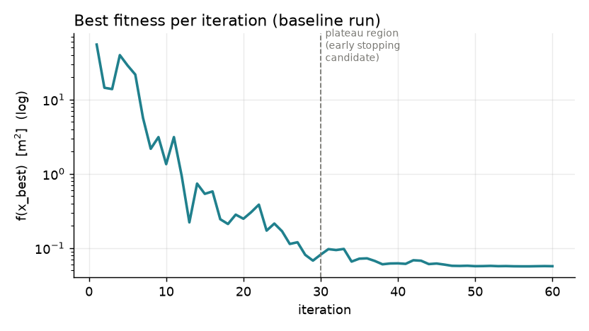 | 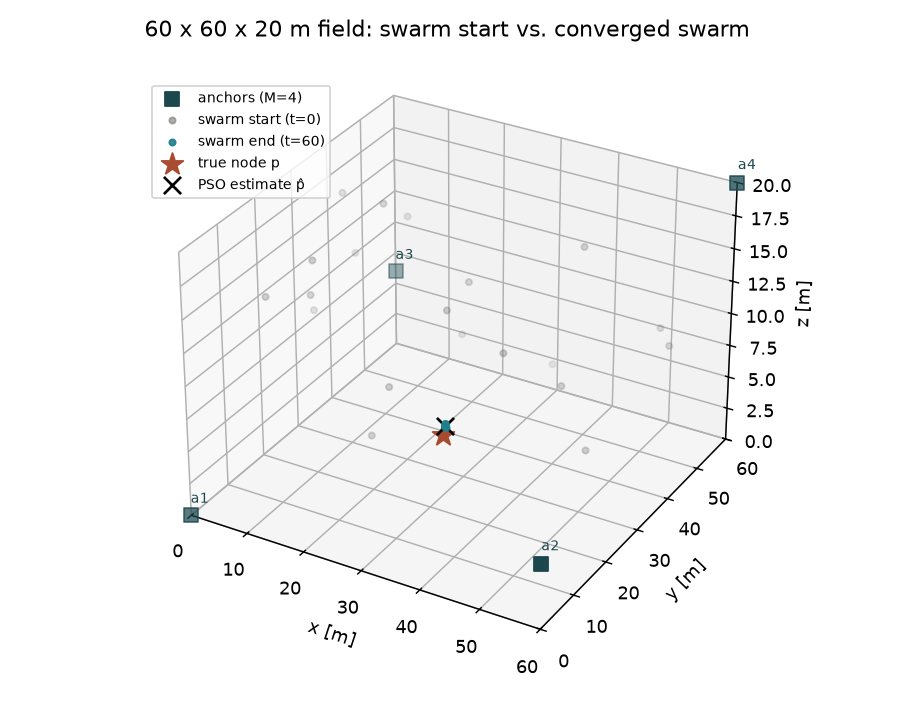 |

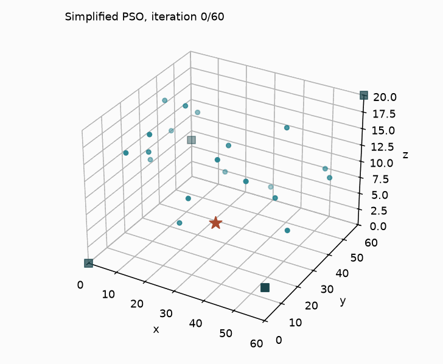

Geometry of this scenario ([`python -m pso3d geometry`](docs/geometry.md)): anchor rank 3 (non-coplanar), GDOP 5.29 at the
true node, Cramér–Rao bound 2.65 m for σ = 0.5 m with a vertical component of 2.54 m against 0.44 m / 0.60 m
horizontally — the formal version of the Δz remark above. The true node lies only 2.7 m from the anchors'
least-squares plane, so its mirror image fits the four ranges almost as well (flip-ambiguity risk 0.74); the Review-1
estimate itself is clearly on the correct side (0.06).

## Monte-Carlo parameter study

200 random nodes per setting, uniform in the field, Gaussian ranging noise; the first four anchors are the fixed
non-coplanar corners above, extra anchors are random. Full tables: [`results/results.md`](results/results.md),
raw data: [`results/sweeps.csv`](results/sweeps.csv).

| σ = 0.5 m, 4 anchors, N = 20, T = 60 | RMSE (m) | median (m) | p90 (m) | fitness evals | memory (floats) |
|---|---|---|---|---|---|
| Simplified PSO (best-of-iteration) | 8.38 | 4.66 | 14.65 | 1 200 | 120 |
| Standard PSO (pbest/gbest) | 6.53 | 1.67 | 12.93 | 1 220 | 183 |
| Least-squares trilateration | 5.86 | 4.48 | 9.85 | 0 | 15 |
| Least squares + Gauss-Newton | 4.17 | 1.48 | 6.53 | ≈ 8 | 15 |

| Noise | Anchors |
|---|---|
| 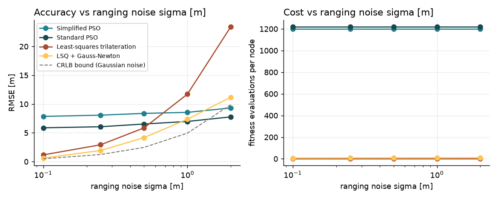 | 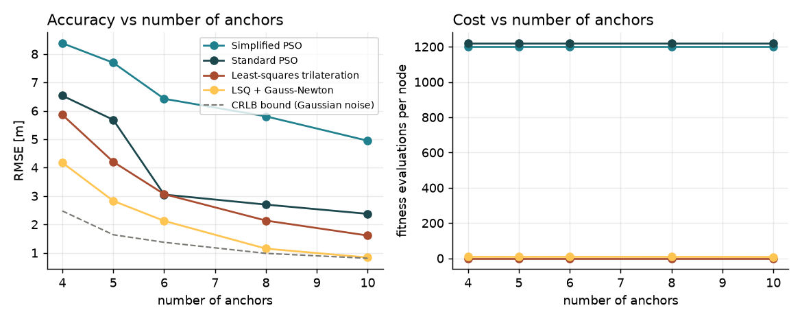 |
| **Swarm size** | **Iterations** |
| 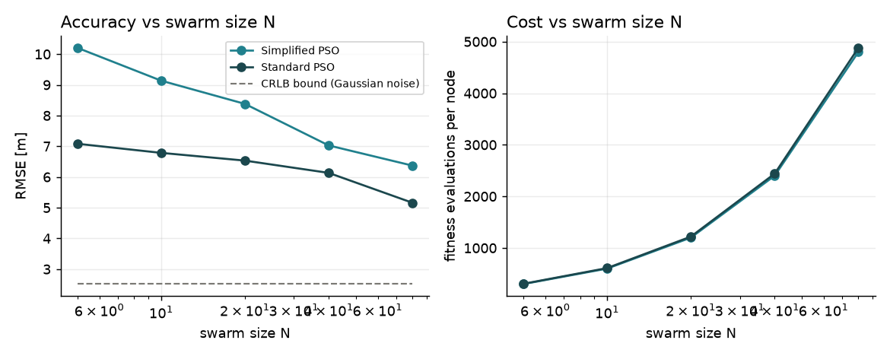 | 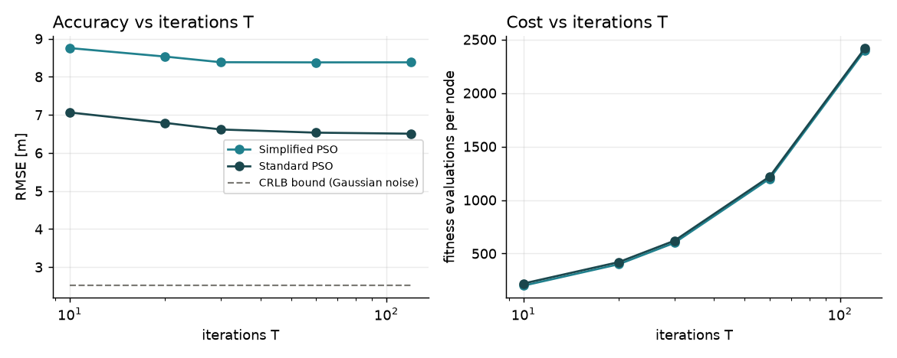 |

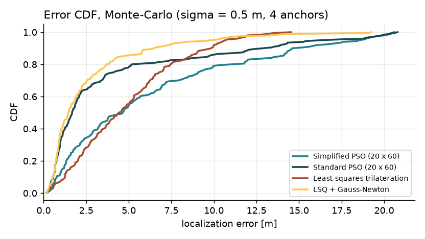

What the study shows (and what it does not):

* The single-node 0.90 m result **does not generalise** to arbitrary node positions with only four corner anchors:
  errors have a heavy tail (p90 > 10 m) for every method. This is a geometry problem — nodes far from the anchors
  and the small height spread (0–20 m) produce weak vertical geometry and flip ambiguity along z — exactly Gap 1 of
  the Review-1 deck.
* The simplified PSO (no personal/global-best memory) converges prematurely: even at σ = 0.1 m its RMSE is ≈ 7.9 m,
  while standard PSO and Gauss-Newton reach ≈ 1 m. Memory-free swarms are cheap (120 floats) but pay in accuracy —
  the accuracy-vs-cost trade-off Phase 2 is about.
* More anchors help every method (RMSE roughly halves from 4 → 10 anchors); more particles help slowly and cost
  linearly; more than ≈ 30 iterations bring nothing for the simplified PSO (plateau).
* Least squares + Gauss-Newton is the strongest and cheapest single-node estimator here (≈ 8 residual evaluations,
  15 floats) and is therefore the natural **warm start** for PSO in Phase 2.

### Phase-2 extension: more methods and the Cramér–Rao reference

`python -m pso3d experiments --trials 200 --extended --out results/extended --figures figures/extended` runs the same
200 random nodes per setting with four more methods and adds a **CRLB** column: the mean Cramér–Rao lower bound on the
RMSE of any unbiased estimator for the sampled node positions and σ = 0.5 m ([`pso3d/geometry.py`](pso3d/geometry.py),
[`docs/geometry.md`](docs/geometry.md)). No method can beat the bound; the gap above it is what better optimisation can
still recover, the rest is anchor geometry. Full tables: [`results/extended/results.md`](results/extended/results.md);
method keys, the frozen RNG order and the CLI: [`docs/experiments.md`](docs/experiments.md).

| σ = 0.5 m, 4 anchors, N = 20, T = 60 | RMSE (m) | median (m) | p90 (m) | CRLB (m) | fitness evals | iterations | memory (floats) |
|---|---|---|---|---|---|---|---|
| Simplified PSO | 8.38 | 4.66 | 14.65 | 2.51 | 1 200 | 60 | 120 |
| Standard PSO | 6.53 | 1.67 | 12.93 | 2.51 | 1 220 | 60 | 183 |
| Least-squares trilateration | 5.86 | 4.48 | 9.85 | 2.44 | 0 | – | 15 |
| LSQ + Gauss-Newton | 4.17 | 1.48 | 6.53 | 2.44 | 8 | 8.3 | 15 |
| AMCMPSO *(interpretation)* | 5.47 | 1.55 | 8.41 | 2.51 | 1 220 | 60 | 186 |
| Standard PSO + `Tolerance(1e-2, 10)` stop | 6.74 | 1.76 | 13.42 | 2.51 | 781 | 38.1 | 183 |
| Standard PSO + LSQ/GN warm start | **3.19** | **1.32** | **4.66** | 2.51 | 1 220 | 60 | 183 |
| AMCMPSO *(interpretation)* + warm start | **3.19** | **1.32** | **4.66** | 2.51 | 1 220 | 60 | 186 |

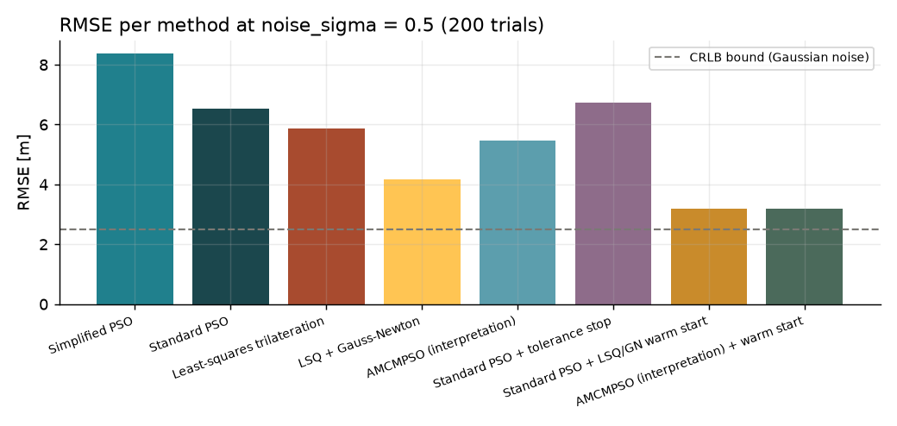

* The **warm start removes most of the heavy tail**: seeding particle 0 with the closed-form estimate brings the
  swarm's p90 from 12.9 m to 4.7 m with the same four corner anchors and the same budget — the plateau and flip
  failures of the cold swarm were optimiser problems. The remaining gap to the bound (3.19 m vs 2.51 m) is geometry.
* The tolerance stop saves 36 % of the evaluations (781 vs 1 220) at essentially unchanged accuracy.
* The AMCMPSO interpretation sits between the standard swarm and the warm-started swarm; its numbers describe this
  repository's implementation on this scenario only (see the Roadmap).
* The CRLB column differs slightly between the swarm rows (2.51 m) and the closed-form rows (2.44 m) because the
  swarm methods draw one extra per-trial seed, so their 200 node positions are a different sample.

## Multi-node auto-localization (Phase 2)

`python -m pso3d network` ([`pso3d/network.py`](pso3d/network.py), [`docs/network.md`](docs/network.md)) deploys
N unknown nodes and M beacons uniformly in a 100 × 100 × 30 m field and runs the iterative scheme of Kulkarni et al.
(2009, Section IV) in 3D: every round, each node that hears at least four non-coplanar references (beacons or
already-localized nodes, at most the six nearest) localizes itself with the chosen single-node estimator; localized nodes
advertise their *estimates* and serve as references in the next round. Metrics follow the paper: N_NL (nodes not
localized), E_l (mean squared error over localized nodes), plus RMSE and coverage.

| Run (standard PSO 20 × 60, Gaussian σ = 0.5 m, seed 1) | Rounds | Coverage | N_NL | E_l (m²) | RMSE (m) | Fitness evals |
|---|---|---|---|---|---|---|
| 50 nodes, 10 beacons, radio range 25 m (defaults) → [`results/network.md`](results/network.md) | 3 | 4 % | 48 | 1.24 | 1.11 | 2 440 |
| 50 nodes, 10 beacons, radio range 50 m (`--range 50`) → [`results/network_r50/network.md`](results/network_r50/network.md) | 2 | 100 % | 0 | 32.9 | 5.74 | 61 000 |

* With the paper's radio range of 25 m a 3D node rarely hears four beacons at once (0.9 on average with 6 beacons,
  1.3 with 10), so almost nothing settles — connectivity, not the optimiser, limits coverage; doubling the range
  localizes every node in two rounds.
* Errors propagate through settled references: the 13 nodes of round 2 inherit the errors of the 37 round-1 estimates
  they use as anchors, which is why the RMSE of the fully-covered run (5.7 m) is far above the single-node figures.
  Nothing re-estimates a settled node later; this is the honest starting point for Phase-2 work on reference quality.

| Rounds (r = 50 m) | Map (r = 50 m) |
|---|---|
| 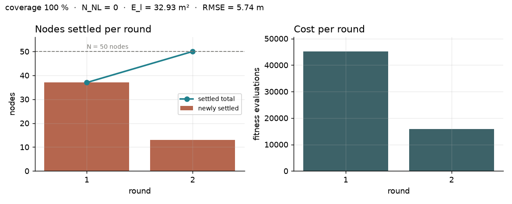 | 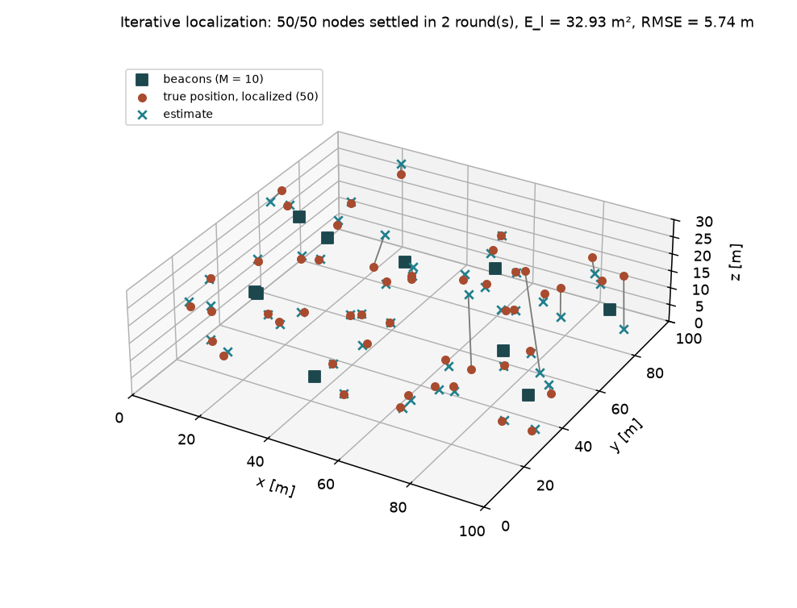 |

## Interactive web simulation

[`web/`](web/) is a static page (Plotly.js, no build step) deployed on Vercel: **https://capstone-pso3d.vercel.app**

* Edit field size, anchors (add/remove, ≥ 4), per-anchor noise or Gaussian σ, true node, swarm size, iterations,
  w, c1/c2, seed, clipping, and the PSO variant (simplified vs standard).
* Step / play / run-to-end; watch the particles converge in 3D with the best-estimate trail; live KPIs for estimate,
  error, best fitness, fitness evaluations, distance computations, swarm memory and the least-squares comparison;
  log-scale convergence chart.
* The JS port uses a seeded mulberry32 generator, so runs are repeatable but do not reproduce the NumPy
  `default_rng(1)` numbers bit-for-bit.
* New in Phase 2 ([`docs/web_simulator.md`](docs/web_simulator.md)): the AMCMPSO variant (interpretation), stopping
  rules (patience / tolerance / evaluation budget), warm start from least squares + Gauss-Newton, noise models (fixed,
  Gaussian, uniform %, NLOS), KPIs for GDOP, the CRLB bound, anchor geometry and flip-ambiguity risk, inline validation
  instead of `alert()`, labelled controls and live regions, keyboard shortcuts (Space, →, R), shareable links (`#s=…`),
  CSV / JSON export, an offline notice when Plotly cannot be loaded, and a dark colour scheme.
* The closed-form solvers, fitness, geometry diagnostics and the AMCMPSO coefficient schedule are the same code path in
  both languages up to rounding: [`tests/test_parity.py`](tests/test_parity.py) compares the Python package with
  `web/pso.js` / `web/geometry.js` on shared fixtures ([`docs/js_parity.md`](docs/js_parity.md)).
* [`web/vercel.json`](web/vercel.json) sends an enforced Content-Security-Policy (scripts only from the page and
  cdn.plot.ly) and other security headers; `node tests/e2e/web_smoke.js` exercises every workflow above in headless
  Chromium with those headers enforced ([`tests/e2e/README.md`](tests/e2e/README.md)).

## Roadmap

- [x] Formulation, baseline simplified PSO, evaluation and memory counters (Objectives 1, 4)
- [x] Least-squares / Gauss-Newton comparison, Monte-Carlo parameter study, plots (Objective 3)
- [x] Interactive 3D web simulation on Vercel
- [x] Early stopping with tolerance, least-squares warm start, noise models (Gaussian, uniform %, shadowing, NLOS),
      geometry diagnostics (GDOP, CRLB, flip ambiguity), robust Huber fitness
- [x] Multi-node auto-localization (localized nodes become anchors) with coverage metric
- [ ] **AMCMPSO** ([`pso3d/amcmpso.py`](pso3d/amcmpso.py), [`docs/amcmpso.md`](docs/amcmpso.md)) — a configurable
      *interpretation* is implemented and tested (adaptive w/c1/c2 with linear or cosine schedules, swarm-mean and
      centre-of-mass guidance, stopping rules, warm start, diagnostics), but the exact update equations and constants
      still have to be transcribed from Section 3 of Alhasan et al. (2023) and validated against the paper's reported
      numbers (improvement rate 99.86 %, error < 1.34 cm, 3D coverage > 87 %). Its current output must not be quoted as
      a reproduction of the paper.
- [ ] Phase 2 (remaining): reference-quality weighting in the network scheme, compact / reduced-state swarms, energy
      model, comparison against the paper's network sizes

## Team and guide

| Role | Name | Roll no. |
|---|---|---|
| Team leader | D L Narayana | 2023006368 |
| Member | Kommareddy Chiranjeevi Ashutosh | 2023002406 |
| Member | S N S Vijay Vagdeesh | 2023005066 |
| Member | Pukkalla Yaswanth | 2023004181 |

**Guide:** Dr. Pujasuman Tripathy, Assistant Professor, Department of Computer Science and Systems Engineering,
GITAM School of Computer Science and Engineering, Visakhapatnam.

## Repository documents (Review 1)

* `3D Localization in WSN — 10 Codes with Summaries.pdf` — the ten original scripts (RSSI ranging, trilateration,
  least squares, DV-Hop, weighted centroid, APIT, Gauss-Newton MLE, MDS-MAP, PSO, Kalman) with explanations
* `PSO-Based 3D Localization in WSN — Paper Review.docx` — literature review (10 papers + base paper)
* `Base Paper — Bio-inspired Node Localization in WSN (Kulkarni et al., 2009).pdf` — background paper [4]

## References

1. R. V. Kulkarni and G. K. Venayagamoorthy, "Particle swarm optimization in wireless-sensor networks: A brief survey," *IEEE Trans. Systems, Man, and Cybernetics, Part C*, 41(2), 262–267, 2011. https://doi.org/10.1109/TSMCC.2010.2054080
2. R. Ahmad, W. Alhasan, R. Wazirali, N. Aleisa, "Optimization algorithms for wireless sensor networks node localization: An overview," *IEEE Access*, 12, 50459–50488, 2024. https://doi.org/10.1109/ACCESS.2024.3385487
3. J. Kumari, P. Kumar, S. K. Singh, "Localization in three-dimensional wireless sensor networks: a survey," *The Journal of Supercomputing*, 75(8), 5040–5083, 2019. https://doi.org/10.1007/s11227-019-02781-1
4. R. V. Kulkarni, G. K. Venayagamoorthy, M. X. Cheng, "Bio-inspired node localization in wireless sensor networks," *Proc. IEEE SMC*, 205–210, 2009. https://doi.org/10.1109/ICSMC.2009.5346107
5. J. Kennedy and R. Eberhart, "Particle swarm optimization," *Proc. IEEE ICNN*, 1942–1948, 1995. https://doi.org/10.1109/ICNN.1995.488968
6. V. Kanwar and A. Kumar, "Range free localization for three dimensional wireless sensor networks using multi objective particle swarm optimization," *Wireless Personal Communications*, 117(2), 901–921, 2021. https://doi.org/10.1007/s11277-020-07902-1
7. H. Wu, J. Liu, Z. Dong, Y. Liu, "A hybrid mobile node localization algorithm based on adaptive MCB-PSO approach in wireless sensor networks," *Wireless Communications and Mobile Computing*, 2020, art. 3845407. https://doi.org/10.1155/2020/3845407
8. Y. Lv, W. Liu, Z. Wang, Z. Zhang, "WSN localization technology based on hybrid GA-PSO-BP algorithm for indoor three-dimensional space," *Wireless Personal Communications*, 114(1), 167–184, 2020. https://doi.org/10.1007/s11277-020-07357-4
9. X. Huang, D. Han, M. Cui, G. Lin, X. Yin, "Three-dimensional localization algorithm based on improved A* and DV-Hop algorithms in wireless sensor network," *Sensors*, 21(2), 448, 2021. https://doi.org/10.3390/s21020448
10. P. Singh and N. Mittal, "An efficient localization approach to locate sensor nodes in 3D wireless sensor networks using adaptive flower pollination algorithm," *Wireless Networks*, 27(3), 1999–2014, 2021. https://doi.org/10.1007/s11276-021-02557-7
11. G. S. Walia et al., "Three dimensional optimum node localization in dynamic wireless sensor networks," *Computers, Materials & Continua*, 70(1), 305–321, 2022. https://doi.org/10.32604/cmc.2022.019171
12. H. Y. Abuaddous et al., "Repulsion-based grey wolf optimizer with improved exploration and exploitation capabilities to localize sensor nodes in 3D wireless sensor network," *Soft Computing*, 27(7), 3869–3885, 2023. https://doi.org/10.1007/s00500-022-07590-y
13. M. R. Reddy and M. L. Ravi Chandra, "An enhanced 3D-DV-hop localisation algorithm for 3D wireless sensor networks," *Wireless Networks*, 30(6), 5809–5821, 2024. https://doi.org/10.1007/s11276-023-03356-y
14. S. Koulaeizadeh et al., "A hybrid positioning framework for large-scale three-dimensional IoT environments," *Sensors*, 25(22), 6943, 2025. https://doi.org/10.3390/s25226943
15. H. Singh et al., "Hybrid optimized 3D localization for WSN-assisted IoT networks in smart agriculture," *Int. J. of Mathematical, Engineering and Management Sciences*, 10(6), 1967–1988, 2025. https://doi.org/10.33889/IJMEMS.2025.10.6.091
16. **Base paper:** W. Alhasan, R. Ahmad, R. Wazirali, N. Aleisa, W. Abo Shdeed, "Adaptive mean center of mass particle swarm optimizer for auto-localization in 3D wireless sensor networks," *Journal of King Saud University – Computer and Information Sciences*, 35(9), 101782, 2023. https://doi.org/10.1016/j.jksuci.2023.101782

## License

MIT — see [LICENSE](LICENSE).
